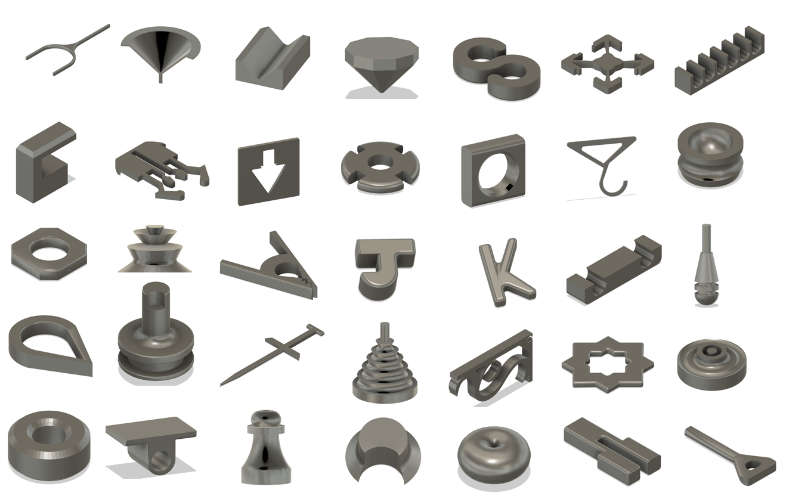
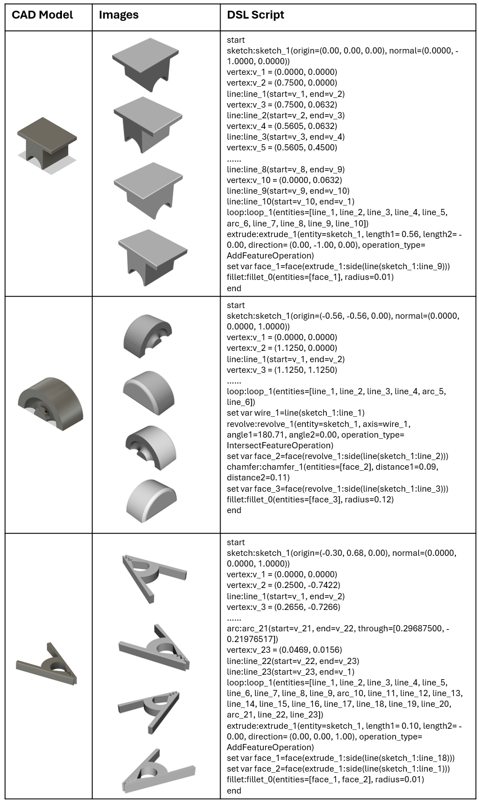
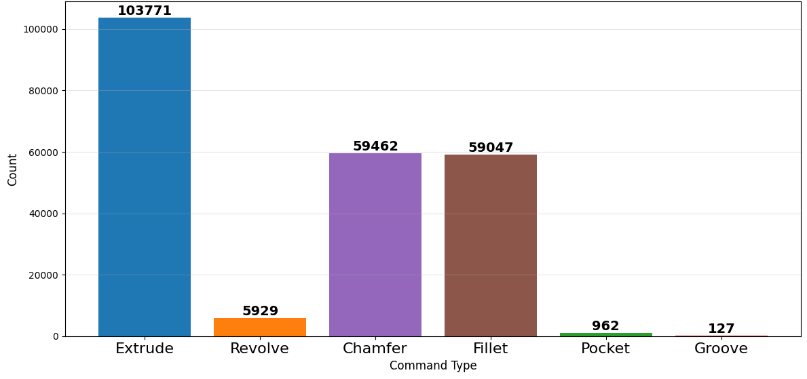
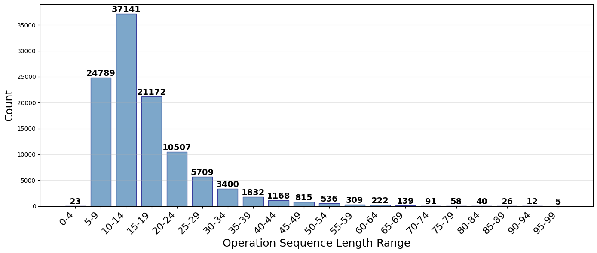

# LLM4CAD-DSL Dataset

LLM4CAD-DSL is a large-scale dataset for training and evaluating AI models that generate editable CAD programs. It pairs CAD construction scripts written in an LLM-friendly domain-specific language with rendered images and STL geometry, making it useful for image-to-CAD generation, CAD program synthesis, and CAD editing research.

The dataset is built from WHUCAD and reconstructed into a text-based CAD DSL designed for language and vision-language models. Unlike datasets that only contain simple sketch-and-extrude sequences, LLM4CAD-DSL includes advanced feature operations such as fillet, chamfer, revolve, groove, and pocket.



## Highlights

- **107,994 CAD models** reconstructed from WHUCAD into LLM4CAD-DSL.
- **Aligned multimodal data**: each model includes a DSL script, STL geometry, and rendered images.
- **Advanced CAD operations** beyond basic extrusion, including fillet, chamfer, revolve, groove, and pocket.
- **LLM-oriented representation** with explicit, human-readable commands and symbolic geometry references.
- **Useful for image-to-CAD and editing tasks**, where models need to produce executable, editable CAD construction sequences.
- **Online DSL-to-CAD parser** available on Hugging Face Spaces: [LLM4CAD-DSL-Parser](https://huggingface.co/spaces/yuewansun/LLM4CAD-DSL-Parser).

## Dataset Structure

The released dataset is organized into three main folders:

```text
dataset/
+-- dsl_data/      # LLM4CAD-DSL scripts
+-- image_data/    # rendered CAD images
+-- stl_data/      # reconstructed STL models
```

Each sample is aligned across the three folders by its model identifier. A typical data point contains:

- one **DSL script** describing the CAD construction sequence;
- one **STL file** containing the reconstructed 3D geometry;
- four **rendered images** from different isometric viewpoints.



## What Is in `dsl_data/`?

`dsl_data/` contains text-based LLM4CAD-DSL programs. These scripts describe how a CAD model is built step by step, including sketches, 2D entities, feature operations, and references to generated geometry.

Example command styles include:

```text
sketch:sketch_1(origin=(0.00, 0.00, 0.00), normal=(0.0000, 0.0000, 1.0000))
line:line_1(start=v_1, end=v_2)
extrude:extrude_1(entity=sketch_1, length1=0.75, length2=0.00)
fillet:fillet_1(entities=[edge_1, edge_2], radius=0.04)
```

A key feature of LLM4CAD-DSL is symbolic geometry selection. Instead of forcing a model to calculate 3D coordinates for every downstream operation, generated entities can be referenced through stable names such as edges, faces, ridges, caps, and side faces. This makes the scripts easier for LLMs to generate, inspect, and edit.

## What Is in `image_data/`?

`image_data/` contains rendered views of each CAD model. These images are intended for multimodal CAD tasks, especially image-to-CAD generation, where a model receives a CAD image and predicts the corresponding DSL program.

Each CAD model is rendered from four isometric viewpoints, giving learning systems multiple visual observations of the same underlying construction sequence.

## What Is in `stl_data/`?

`stl_data/` contains reconstructed STL files generated from the LLM4CAD-DSL scripts. These meshes can be used for visualization, geometric comparison, downstream processing, or as a check that generated DSL scripts produce valid 3D shapes.

In the reconstruction study, STL models generated from LLM4CAD-DSL were compared with the original WHUCAD CAD models using intersection-over-union, reaching an average IoU of **95.8%**.

## Supported CAD Operations

LLM4CAD-DSL supports both basic sketch construction and advanced solid modeling operations:

| Category | Operations |
| --- | --- |
| Sketch entities | sketch, vertex, line, arc, circle, loop |
| Feature creation | extrude, revolve |
| Feature removal | pocket, groove |
| Detail operations | fillet, chamfer |
| Script utilities | variable assignment, symbolic entity references |

### Command Syntax Examples

The table below shows examples of supported LLM4CAD-DSL operations and their corresponding command syntax.

| Operation | Example |
| --- | --- |
| Define sketch | `sketch:sketch_1(origin=(-0.23, -0.09, 0.00), normal=(0.0000, 0.0000, 1.0000))` |
| Define variable | `set var edge_2=edge(revolve_1:ridge(vertex(sketch_1:v_2)))`<br>`set var face_1=face(extrude_1:side(line(sketch_1:arc_1)))` |
| Add line | `vertex:v_1=(0.0000, 0.0000)`<br>`vertex:v_2=(0.7500, 0.0000)`<br>`line:line_1(start=v_1, end=v_2)` |
| Add arc | `arc:arc_2(start=v_12, end=v_13, center=v_14)` |
| Add circle | `circle:circle_1(center=vertex_1, radius=0.0103)` |
| Add loop | `loop:loop_2(entities=[line_11, arc_13, line_14, circle_16])` |
| Extrude | `extrude:extrude_1(entity=sketch_1, length1=-0.75, length2=0.00)` |
| Revolve | `revolve:revolve_1(entity=sketch_1, axis=line_1, angle1=360.00, angle2=0.00)` |
| Fillet | `fillet:fillet_1(entities=[edge_5, edge_6, edge_7], radius=0.04)` |
| Chamfer | `chamfer:chamfer_1(entities=[edge_1, face_2], distance1=0.01, distance2=0.02)` |
| Pocket | `pocket:pocket_1(entity=sketch_2, length1=0.34, length2=0.00)` |
| Groove | `groove:groove_1(entity=sketch_1, axis=line_1, angle1=360.00, angle2=0.00)` |

The operation distribution and sequence-length distribution show that the dataset contains many nontrivial CAD programs, not only short extrusion-only examples.





## Recommended Uses

This dataset is designed for research and development in:

- image-to-CAD generation;
- vision-language model fine-tuning for CAD;
- CAD program synthesis;
- editable CAD generation;
- CAD script parsing and repair;
- geometry-aware retrieval;
- instruction-based CAD editing;
- benchmarking LLM-friendly CAD representations.

Because the dataset provides aligned scripts, images, and geometry, it can support both supervised learning and evaluation pipelines.

## Why LLM4CAD-DSL?

Conventional CAD scripting workflows often require coordinate-heavy geometric reasoning. For example, applying a fillet or chamfer may require selecting an exact edge based on 3D coordinates or topology queries. This is difficult for current LLMs and makes editing brittle: changing an earlier feature may force many downstream coordinate references to be recomputed.

LLM4CAD-DSL addresses this by using explicit commands and symbolic references to generated entities. A model can refer to geometry by named construction relationships instead of recomputing low-level coordinates. This makes the representation more readable, more local to edit, and better aligned with language-model generation.

## Online DSL Parser

You can try the LLM4CAD-DSL parser online through the Hugging Face Space:

[LLM4CAD-DSL-Parser](https://huggingface.co/spaces/yuewansun/LLM4CAD-DSL-Parser)

The parser converts LLM4CAD-DSL scripts into CAD models, making it a convenient way to inspect dataset examples, test generated DSL programs, and demonstrate the connection between the textual DSL representation and reconstructed 3D geometry.

## Getting Started

1. Download or clone the dataset repository.
2. Browse `image_data/` to inspect rendered examples.
3. Open the matching file in `dsl_data/` to view the construction script.
4. Use the matching STL file in `stl_data/` for 3D visualization or geometry checks.

For model training, use the rendered images as visual inputs and the DSL scripts as target sequences. For editing tasks, DSL scripts can be paired with natural-language edit instructions and modified scripts.

## Citation

If you use this dataset, please cite the LLM4CAD-DSL paper:

```bibtex
@article{llm4cad_dsl,
  title   = {LLM4CAD-DSL: An LLM-Friendly Domain-Specific Language for Computer-Aided Design Generation},
  author  = {Sun, Yuewan and Sha, Zhenghui},
  journal = {TBD},
  year    = {2026}
}
```

## Acknowledgement

LLM4CAD-DSL is constructed from WHUCAD, a parametric feature-based CAD dataset. We thank the WHUCAD authors for making their dataset and reconstruction resources available to the community.
